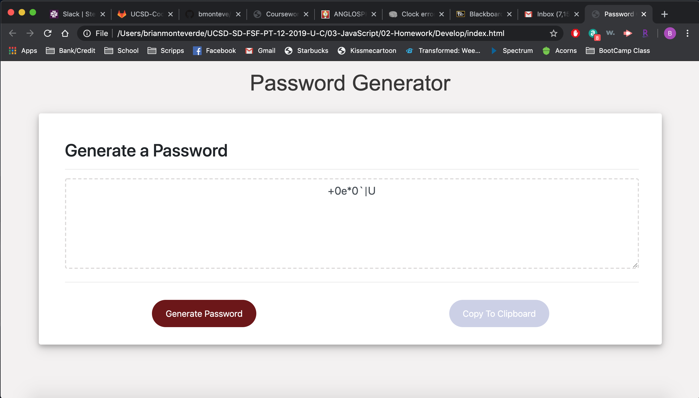

# PassGen

1) Purpose: Allows a user to generate a random password of a desired specified length and character types. 

2) Functionalilty: Displays the password generator immediately. Allows the user to hit a generate password button. It then prompts the user to designate a length for the password and charcter types for the password. It prevents the user from entering values that are not within 8 and 128 for character length unless the user cancels their generate button click. It also forces the user to choose at least one character type for the password. The copy button places the generated password in the users operating clipboard. It is also responsive to different viewport sizes. 

Deployed Git Hub Link: https://bmonteve.github.io/PassGen/